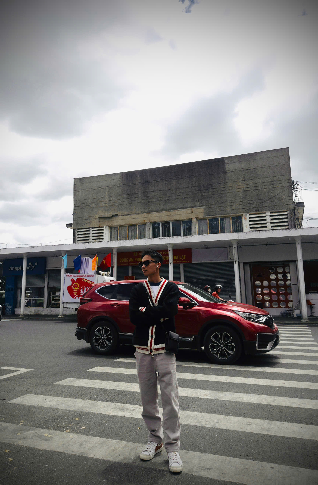
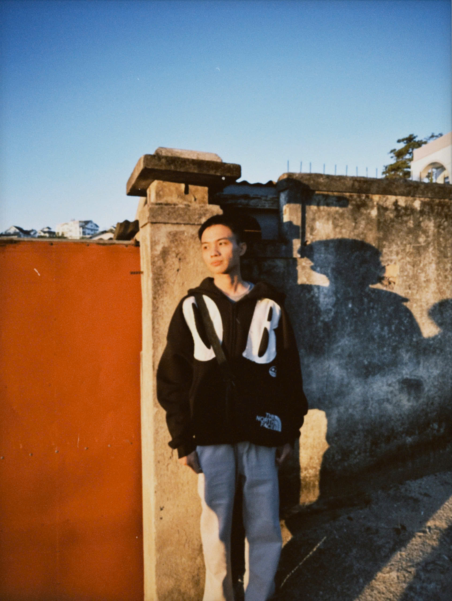

<!-- README.md -->

---

<table border="0">
  <tr>
    <td width="300" align="center" valign="top">
      
        
      

        <code>LOCATION: HO CHI MINH CITY, VN</code> 
        <code>Uptime since 2005</code>
      

    </td>
    <td valign="top">
      <h2>🧬 CORE MISSION</h2>
      

        I am a <b>Digital Infrastructure Architect</b> and <b>Full-Stack Developer</b> currently navigating the complex layers of Information Technology at <b>HCMUS</b>. My work exists at the intersection of high-availability backend systems and seamless user-centric interfaces.
      

      

        I don't just write code; I design resilient ecosystems that thrive under load. From crafting modular microservices to orchestrating cloud-native deployments, my objective is <b>absolute technical precision.</b>
      

      <table border="0" width="100%">
        <tr>
          <td width="33%" align="center">
            
          </td>
          <td width="33%" align="center">
            
          </td>
          <td width="33%" align="center">
            
          </td>
        </tr>
      </table>
    </td>
  </tr>
</table>

---

## 🛠️ THE COMMAND CENTER

### **SYSTEM ORCHESTRATION & CLOUD**

### **FOUNDATIONAL CODE & DATA**

### **MONITORING & LOGISTICS**

---

<table border="0">
  <tr>
    <td valign="top">
      <h2>🛰️ THE LAB & WORKFLOW</h2>
      
My development environment is a carefully curated stack designed for peak efficiency:

      <ul>
        <li><b>Hardware:</b> MacBook Pro ecosystem – the heart of my local node.</li>
        <li><b>AI Engines:</b> <b>Antigravity</b> (Agentic Logic) & <b>CloudCode</b> (Deployment Ops).</li>
        <li><b>Productivity:</b> VS Code (Deeply customized) & iTerm2 (The Command Line).</li>
      </ul>
      

        <i>Currently focused on building the most robust CI/CD pipelines in the cloud space.</i>
      

    </td>
    <td width="350" align="center">
       
        
       <i><small>// snapshot_02: the architect in the wild</small></i>
    </td>
  </tr>
</table>

---

## 📊 REAL-TIME ANALYTICS

  

 

  <table border="0" width="100%">
    <tr>
      <td width="33%" align="center"></td>
      <td width="33%" align="center"></td>
      <td width="33%" align="center"></td>
    </tr>
  </table>

---

## 📡 ESTABLISH COMMUNICATION

  
  
  
  
  
  

 

  © 2024 - 2026 NGO GIA AN
    
  

    
     
    
  

