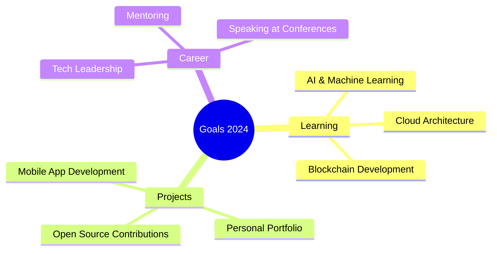

<div align="center">

<!-- Animated Header -->


<!-- Typing Animation -->
<h1 align="center">
  
</h1>

<!-- Profile Animation -->


</div>

---

## 🚀 About Me


```typescript
const developer = {
  name: "NGO GIA AN",
  location: "Ho Chi Minh City",
  role: "Software Developer",
  company: null,
  experience: "1 years",
  
  code: ["JavaScript", "TypeScript", "C++", "Java"],
  technologies: {
    frontEnd: ["React", "Next.js"],
    backEnd: ["Node.js", "Express"],
    databases: ["MongoDB", "MySQL"],
    cloud: ["AWS", "Google Cloud", "Azure"],
    tools: ["Docker", "Git"]
  },
  
  currentlyLearning: ["AI/ML", "Blockchain", "Cloud Architecture"],
  lookingFor: "Software developer internship",
  funFact: "I debug with console.log() and I'm not ashamed! 🤷‍♂️"
};
```

---

## 🛠️ Tech Stack & Tools

<div align="center">

### 💻 Languages
<p>
  
  
  
  
  
</p>

### 🎨 Frontend
<p>
  
  
  
  
  
</p>

### ⚙️ Backend
<p>
  
  
  
  
</p>

### 🗄️ Databases
<p>
  
  
  
  
</p>

### ☁️ Cloud & DevOps
<p>
  
  
  
  
  
</p>

</div>

---

## 📈 GitHub Analytics

<div align="center">
  


</div>

<div align="center">
  


</div>

---

## 🏆 GitHub Trophies

<div align="center">
  


</div>

---

## 💼 Experience & Education

<table>
<tr>
<td width="50%">

### 🎯 Professional Experience

**🚀 [Current Position] @ [Company Name]**  
*[Start Date] - Present*
- 🔹 [Key achievement or responsibility]
- 🔹 [Key achievement or responsibility]
- 🔹 [Key achievement or responsibility]

**💻 [Previous Position] @ [Company Name]**  
*[Start Date] - [End Date]*
- 🔹 [Key achievement or responsibility]
- 🔹 [Key achievement or responsibility]

</td>
<td width="50%">

### 🎓 Education

**🏫 [Degree] in [Field]**  
*[University Name] | [Graduation Year]*
- GPA: [Your GPA]
- Relevant Coursework: [Courses]

**📜 Certifications**
- 🏆 [Certification Name] - [Organization]
- 🏆 [Certification Name] - [Organization]
- 🏆 [Certification Name] - [Organization]

</td>
</tr>
</table>

---

## 🌟 Featured Projects

<div align="center">

<!-- Project Cards -->
<table>
<tr>
<td width="50%">

### 🚀 [Project Name 1]
[](https://github.com/[YOUR_USERNAME]/[REPO_NAME])

**Tech Stack:** React, Node.js, MongoDB  
**Features:**
- ✨ [Feature 1]
- ✨ [Feature 2]
- ✨ [Feature 3]

[🔗 Live Demo](https://your-demo-link.com) | [📱 GitHub](https://github.com/username/repo)

</td>
<td width="50%">

### 🎨 [Project Name 2]
[](https://github.com/[YOUR_USERNAME]/[REPO_NAME])

**Tech Stack:** Vue.js, Python, PostgreSQL  
**Features:**
- 🎯 [Feature 1]
- 🎯 [Feature 2]
- 🎯 [Feature 3]

[🔗 Live Demo](https://your-demo-link.com) | [📱 GitHub](https://github.com/username/repo)

</td>
</tr>
</table>

</div>

---

## 📊 Weekly Coding Activity

<div align="center">

<!--START_SECTION:waka-->
<!-- This section will be automatically updated by Wakatime -->
<!--END_SECTION:waka-->


</div>

---

## 🎯 Current Goals & Learning

<div align="center">



</div>

---

## 🤝 Let's Connect!

<div align="center">


### 📫 How to reach me:

<p>
<a href="mailto:[your-email@example.com]">
  
</a>
<a href="https://linkedin.com/in/[your-linkedin]">
  
</a>
<a href="https://twitter.com/[your-twitter]">
  
</a>
<a href="https://[your-portfolio].com">
  
</a>
</p>

### 💡 Open for:
- 🚀 Collaborating on interesting projects
- 💼 Job opportunities
- 🤝 Tech discussions and mentoring
- 📚 Open source contributions

</div>

---

## 📈 Profile Views & Visitors

<div align="center">


</div>

---

## 🎵 Currently Listening To

<div align="center">

[](https://open.spotify.com/user/[YOUR_SPOTIFY_ID])

</div>

---

## 💝 Support My Work

<div align="center">

If you like my work and want to support me, you can:

<a href="https://www.buymeacoffee.com/[YOUR_USERNAME]" target="_blank">
  
</a>

</div>

---

<div align="center">

### ⭐ Don't forget to star my repositories if you find them helpful!


**"Code is like humor. When you have to explain it, it's bad."** – Cory House

</div>

<!-- Footer Wave -->

